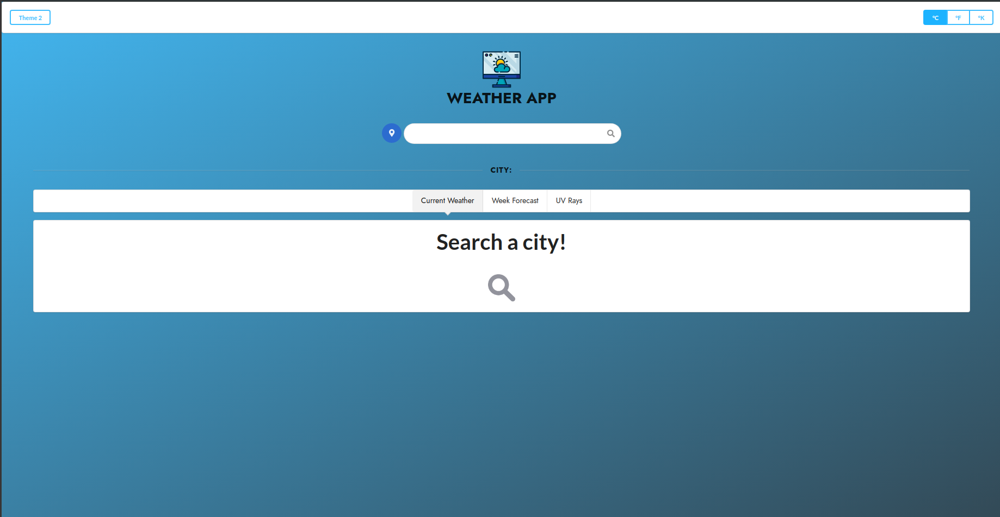
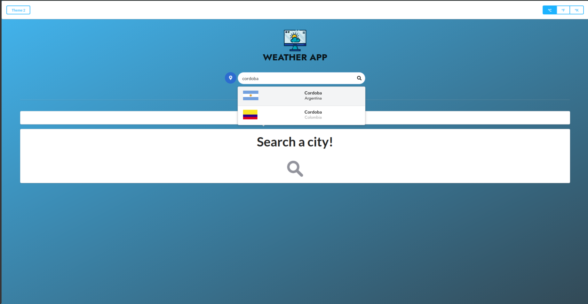
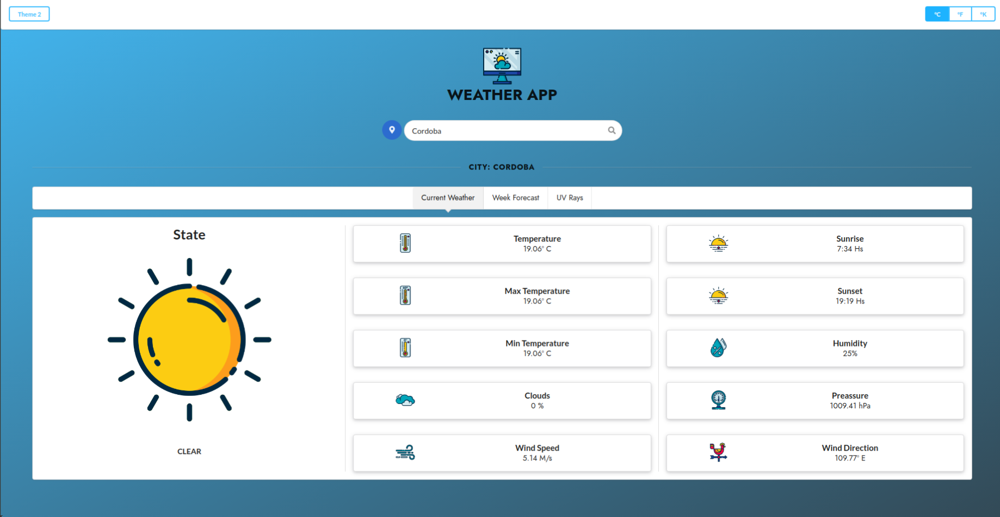
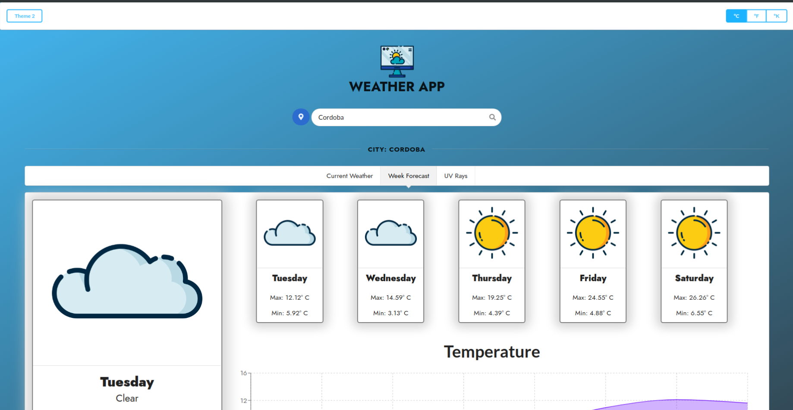
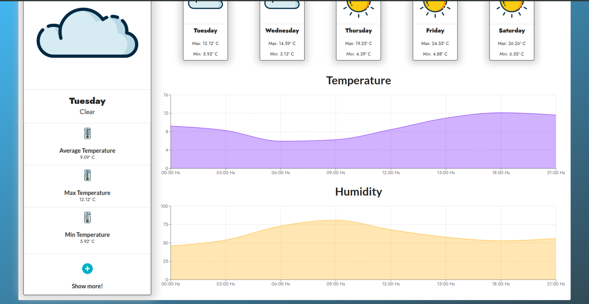
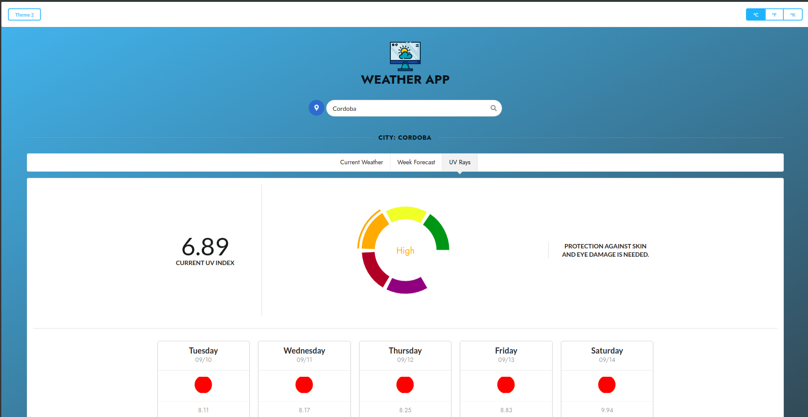
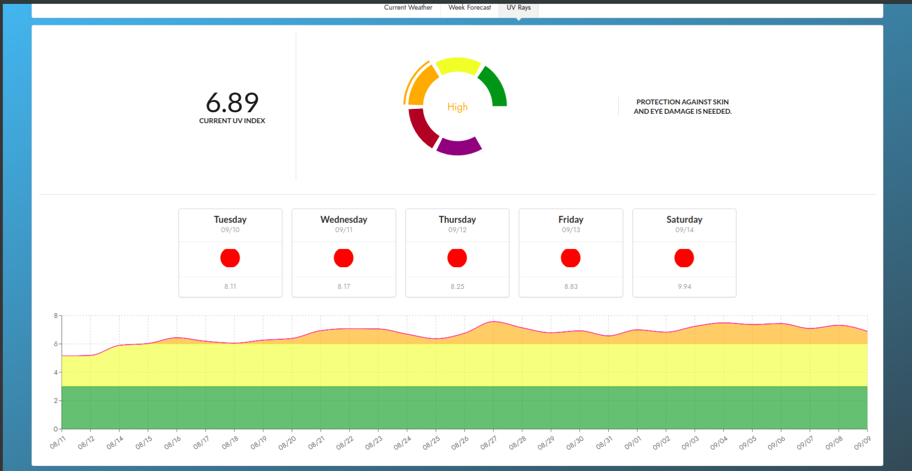

# ReactJS    
***
## MyWeather App    

In this project, we built a weather app that tells us the current weather in a given location (by a search, or by browser geolocation). It also tells you the week forecast, and the current UV Rays data, with their respective graphics.    

***

### Files and Directories    

Our file structure is as follows:    

```
.
├─ public
│   ├─ index.html
│   ├─ icons
│   ├─ images
├─ src
│   ├─ components   // Most important directory
│   │  ├─ Menu
│   │  ├─ Modular
│   │  ├─ Search
│   │  ├─ Tabs
│   │  ├─ Title
│   │  └─ App.jsx
│   ├─ css
│   ├─ helpers
│   └─ index.js
└─ ...
```

The main component is `App.js`, it calls and renders all the needed components by the entire application. It renders what should be rendered at any particular moment.    
The other files are modular components that manages only their own tasks.    
The `Menu` component renders the body of the application, calling the `SearchBar` and the `Tabs` component.    
When a `Tab` is selected, then `WeatherCard`/`ForecastCard`/`UVTab` will be rendered, each managing it's own information, and calling some children components to manage subtasks such as graph rendering.    
We use the `helpers` folders, to work with the API and transform its results, for example to have day name from seconds, or map the icons from the API to the ones we use.    

***

### Libraries and Resources    

- [Semantic UI](https://react.semantic-ui.com/) was used for the styling of the webpage    
- [Recharts](http://recharts.org/) was used for the interactive graphics    
- [React-World-Flags](https://www.npmjs.com/package/react-world-flags) was used for the flag which appear on the search results    
- For the icons, we used 2 different themes from Flaticon: [this](https://www.flaticon.com/packs/weather-220) and [this](https://www.flaticon.com/packs/weather-218).    
- The used font for the entire app is [Jost*](https://fontsarena.com/jost-by-owen-earl/).    

***

### Running the app:    

- Clone the repo to your machine:    
\- `git clone https://github.com/octaviotastico/Weather_App.git`    

- Install npm:    
\- `sudo pacman -S npm`    
or    
\- `sudo apt-get install npm`    

- Install yarn:    
\- `sudo npm install -g yarn`    

- Navigate to the cloned repo and create a file called `.env` in the root directory with the following content (only changing the API_KEY with yours):    

> API_KEY=**Your api key**    
> API_FIND=/data/2.5/find    
> API_WEATHER=/data/2.5/weather    
> API_FORECAST=/data/2.5/forecast    
> API_UVI=/data/2.5/uvi    
> API_UVF=/data/2.5/uvi/forecast    
> API_UVH=/data/2.5/uvi/history    
> API_ENDPOINT=http://api.openweathermap.org    

You can generate a free api key from openweathermap.    

- Finally execute:    
\- `yarn install && yarn start`    

- The app will be running on port 8080 of localhost.    

***

### Screenshots:

#### Home

#### Selecting a City

#### Current Weather

#### Week Forecast

#### Week Forecast 2

#### UV Rays

#### UV Rays 2

***